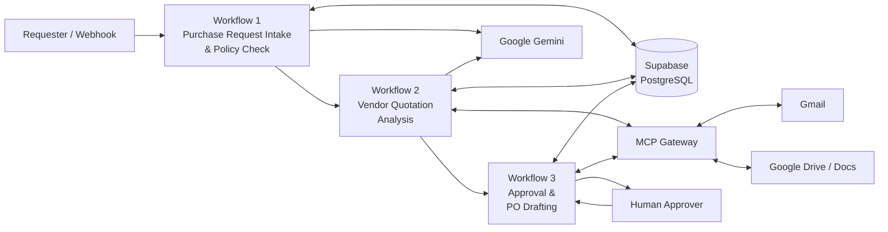

# Procurea — AI-Powered Procurement Automation

> An end-to-end procurement automation system built with **n8n**, **Supabase**, **Google Gemini**, **Gmail**, **Google Drive**, **MCP**, and **human-in-the-loop approval**.


Procurea automates the procurement lifecycle from **purchase request intake** to **vendor quotation analysis**, **AI-assisted recommendation**, **manager approval**, **purchase-order drafting**, and **audit logging**.

The project is designed around a simple principle: **AI can assist with extraction and reasoning, but business-critical procurement decisions should remain deterministic, auditable, and human-controlled.**

---

## What Procurea Does

A purchase request enters the system once and moves through a connected set of n8n workflows:

```text
Purchase Request
      │
      ▼
┌───────────────────────────────┐
│ Workflow 1                    │
│ Intake + Policy Check         │
└───────────────┬───────────────┘
                │ purchase_request_id
                ▼
┌───────────────────────────────┐
│ Workflow 2                    │
│ Vendor Quotation Analysis     │
└───────────────┬───────────────┘
                │ recommendation
                ▼
┌───────────────────────────────┐
│ Workflow 3                    │
│ Approval + PO Drafting        │
└───────────────┬───────────────┘
                │
        ┌───────┴────────┐
        ▼                ▼
     Approved          Rejected
        │                │
        ▼                ▼
 Google Doc PO      Status + Audit
 + Completion       + Notification
```

Across the three workflows, Procurea stores operational state in **Supabase**, uses **Gemini** for structured AI tasks, and uses an **MCP gateway** to expose reusable Gmail and Google Drive capabilities.

---

## System Architecture



### Architectural responsibilities

| Layer | Responsibility |
|---|---|
| **n8n** | Workflow orchestration, routing, deterministic rules, scoring, guardrails, state transitions |
| **Supabase** | Purchase requests, policies, vendors, quotations, approvals, and audit logs |
| **Gemini** | Request analysis, quotation extraction, recommendation reasoning |
| **MCP Gateway** | Reusable Gmail and Google Drive tools exposed through Model Context Protocol |
| **Human approval** | Final approval/rejection before procurement completion |
| **Google Drive / Docs** | Quotation archiving and generated PO drafts |

---

# Workflow Breakdown

## Workflow 1 — Purchase Request Intake & Policy Check

**File:** `workflows/01-purchase-request-intake-policy-check.json`

Workflow 1 is the entry point into Procurea.

### Responsibilities

1. Accept a purchase request through a webhook or manual test trigger.
2. Normalize incoming fields into a consistent schema.
3. Validate required information such as requester, item, quantity, and estimated amount.
4. Read active procurement policies from Supabase.
5. Send the request and policy context to Gemini for structured business analysis.
6. Apply approval thresholds **deterministically in n8n** rather than allowing the LLM to decide policy.
7. Save the purchase request to Supabase.
8. Attach the generated request ID for downstream workflows.
9. Route the request according to the policy result.
10. Write audit information and return a structured response.

### Example input

```json
{
  "requester_name": "Test Requester",
  "requester_email": "requester@example.com",
  "department": "IT",
  "item_name": "Business Laptops",
  "description": "Business laptops required for new hires.",
  "quantity": 5,
  "estimated_amount": 250000,
  "currency": "PKR",
  "urgency": "normal"
}
```

### Key design choice

Gemini can summarize the request and identify risks, but the policy threshold is evaluated by n8n code. This keeps approval logic predictable and auditable.

---

## Workflow 2 — Vendor Quotation Analysis

**File:** `workflows/02-vendor-quotation-analysis.json`

Workflow 2 handles quotation discovery, extraction, comparison, and recommendation.

### Responsibilities

1. Receive `purchase_request_id` from Workflow 1.
2. Retrieve the purchase request and available vendors from Supabase.
3. Use the MCP gateway to search Gmail for quotation emails related to the request.
4. Download email content and attachments.
5. Detect PDF quotation attachments.
6. Archive original quotation files in Google Drive.
7. Extract quotation text from PDFs or email bodies.
8. Ask Gemini to return a structured quotation object.
9. Validate extracted values before saving them.
10. Save quotation records to Supabase.
11. Retrieve all quotations associated with the purchase request.
12. Calculate vendor scores deterministically.
13. Ask Gemini to provide recommendation reasoning.
14. Verify the AI recommendation against deterministic n8n guardrails.
15. Write the final recommendation to the audit trail.
16. Hand the request to Workflow 3.

### Deterministic scoring model

The workflow's vendor-scoring code uses a weighted model:

| Dimension | Weight |
|---|---:|
| Price | 40 |
| Delivery | 25 |
| Specification compliance | 20 |
| Warranty | 10 |
| Payment terms | 5 |
| **Total** | **100** |

A material specification mismatch also triggers a score guardrail so that an attractive price cannot automatically outweigh non-compliance.

### AI guardrail pattern

```text
Quotation data
      │
      ▼
Deterministic n8n score
      │
      ▼
Gemini recommendation
      │
      ▼
Deterministic verification
      │
      ├── valid recommendation ──► accept
      │
      └── invalid/non-compliant ─► override with best valid vendor
```

This separates **AI reasoning** from **decision enforcement**.

---

## Workflow 3 — Approval & PO Drafting

**File:** `workflows/03-approval-po-drafting.json`

Workflow 3 is the human-control and finalization layer.

### Responsibilities

1. Receive the purchase request ID from Workflow 2.
2. Retrieve the purchase request, recommendation, vendor, and quotation data.
3. Build a complete approval packet.
4. Create a pending approval record in Supabase.
5. Send the approval request through the MCP Gmail tool.
6. Pause execution using an n8n Wait node.
7. Present the approver with a form-based **Approve / Reject** decision.
8. Normalize the human decision into a deterministic boolean result.

### Approval path

When approved, Procurea:

- updates the approval record,
- marks the quotation as selected,
- marks the purchase request as approved,
- creates a deterministic PO reference,
- generates the PO draft text,
- creates a native Google Doc through the MCP Drive helper,
- stores PO metadata in the audit log,
- marks the request completed,
- emails the requester a link to the generated PO draft.

### Rejection path

When rejected, Procurea:

- updates the approval decision,
- marks the purchase request rejected,
- records the decision in the audit log,
- sends a rejection notification to the requester.

### Human-in-the-loop principle

The system can automate recommendation and document generation, but the final procurement approval remains a human decision.

---

# MCP Integration

Procurea includes a dedicated MCP layer so Gmail and Google Drive capabilities can be exposed as reusable tools instead of being tightly coupled to a single workflow.

## MCP Gateway

**File:** `mcp/procurea-workspace-mcp-gateway.json`

The gateway exposes procurement-focused tools including:

| MCP Tool | Purpose |
|---|---|
| `search_vendor_emails` | Search Gmail for vendor quotation emails |
| `read_gmail_quotation` | Read quotation attachments from Gmail |
| `search_quote_files` | Search quotation files in Google Drive |
| `read_drive_quotation` | Download and extract quotation PDFs from Drive |
| `send_gmail_email` | Send procurement emails through Gmail |
| Drive upload helper | Create PO documents through a reusable workflow tool |

## Google Drive Helper

**File:** `mcp/procurea-upload-drive-file.json`

This helper receives:

```text
fileName
fileContent
```

and creates a native Google Document. It returns useful metadata such as:

```text
fileId
fileName
mimeType
webViewLink
success
```

That `webViewLink` is then used in the final approval confirmation email.

---

# Data Model

Procurea uses Supabase as the persistence and audit layer.

| Table | Purpose |
|---|---|
| `purchase_requests` | Main procurement request and lifecycle status |
| `policy_rules` | Active procurement rules and approval thresholds |
| `vendors` | Vendor master data |
| `quotations` | Extracted vendor quotation records |
| `approvals` | Pending and completed human approval decisions |
| `audit_logs` | Cross-workflow trace of important procurement actions |

Typical request states used across the workflows include:

```text
submitted
policy_check
needs_approval
approved
rejected
sourcing
completed
```

---

# Technology Stack

| Technology | Role in Procurea |
|---|---|
| **n8n** | Primary automation/orchestration engine |
| **Supabase / PostgreSQL** | Operational database and audit trail |
| **Google Gemini** | Structured extraction and recommendation reasoning |
| **Gmail** | Vendor quotation intake and email notifications |
| **Google Drive / Docs** | Quote archiving and PO document creation |
| **Model Context Protocol (MCP)** | Reusable tool layer for Gmail and Drive |
| **JavaScript Code nodes** | Validation, scoring, normalization, guardrails, deterministic PO creation |
| **n8n Wait / Form** | Human-in-the-loop approval |

---

# Repository Structure

```text
Procurea/
├── workflows/
│   ├── 01-purchase-request-intake-policy-check.json
│   ├── 02-vendor-quotation-analysis.json
│   └── 03-approval-po-drafting.json
│
├── mcp/
│   ├── procurea-workspace-mcp-gateway.json
│   └── procurea-upload-drive-file.json
│
├── .env.example
├── .gitignore
├── LICENSE
└── README.md
```

---

# Setup

## 1. Requirements

You need:

- a self-hosted or compatible n8n installation,
- a Supabase project,
- a Google Gemini API key,
- Gmail OAuth credentials,
- Google Drive OAuth credentials,
- an MCP Bearer Auth credential.

## 2. Environment variables

Copy `.env.example` and configure the required values in the environment where n8n runs:

```env
PROCUREA_SUPABASE_URL=https://YOUR_PROJECT.supabase.co
PROCUREA_SUPABASE_SECRET_KEY=your_supabase_secret_or_service_role_key
GEMINI_API_KEY=your_gemini_api_key
N8N_BLOCK_ENV_ACCESS_IN_NODE=false
```

> Never commit real API keys, service-role keys, OAuth tokens, or Bearer tokens to GitHub.

## 3. Import order

For the cleanest setup, import in this order:

```text
1. Procurea MCP - Upload Drive File
2. Procurea - Workspace MCP Gateway
3. Workflow 3 - Approval & PO Drafting
4. Workflow 2 - Vendor Quotation Analysis
5. Workflow 1 - Purchase Request Intake & Policy Check
```

## 4. Reconnect credentials

After import, re-select the corresponding credentials on nodes that use:

- Supabase,
- Gmail OAuth,
- Google Drive OAuth,
- MCP Bearer Auth.

The repository exports are sanitized and intentionally do not contain usable secrets.

## 5. Re-link sub-workflows

n8n workflow IDs are instance-specific. After importing, re-select the referenced workflows in the Execute Workflow / Workflow Tool nodes:

```text
Workflow 1  → Workflow 2
Workflow 2  → Workflow 3
MCP Gateway → Upload Drive File helper
```

## 6. Activate the MCP gateway

Save and activate the MCP gateway, then use its production MCP endpoint in the MCP Client nodes.

---

# Running Procurea

The primary external entry point is Workflow 1's purchase-request webhook.

Example request:

```powershell
$body = @{
    requester_name   = "Test Requester"
    requester_email  = "requester@example.com"
    department       = "IT"
    item_name        = "Business Laptops"
    description      = "Test purchase request for Procurea"
    quantity         = 5
    estimated_amount = 250000
    currency         = "PKR"
    urgency          = "normal"
} | ConvertTo-Json

Invoke-RestMethod -Method POST `
    -Uri "http://localhost:5678/webhook/procurea-purchase-request" `
    -ContentType "application/json" `
    -Body $body
```

The intended orchestration path is:

```text
Webhook
  → Workflow 1
  → Workflow 2
  → Workflow 3
  → Human decision
  → PO draft / rejection outcome
```

---

# Security & Safety Design

Procurea deliberately keeps high-impact actions constrained.

### Secrets

- No real API keys should be committed.
- `.env` is ignored.
- Exported workflow credential bindings are sanitized in this repository.
- Supabase service credentials should remain server-side.

### AI guardrails

- Gemini does **not** enforce procurement policy.
- Vendor scores are computed deterministically.
- AI recommendations are verified before being accepted.
- Final purchase approval is performed by a human.
- The generated PO is explicitly a **draft** requiring formal authorization before vendor issuance.

### Auditability

Important lifecycle actions are written to `audit_logs`, allowing the workflow history to be reconstructed from persisted data rather than relying only on n8n execution history.

---

# Implementation Notes

### n8n environment variable access

Recent n8n versions may block `$env` references inside workflow nodes by default. If this repository's environment-variable approach is used, run n8n with:

```env
N8N_BLOCK_ENV_ACCESS_IN_NODE=false
```

Alternatively, migrate those values to n8n credential-backed nodes.

### Workflow handoff requirement

Workflow 2 validates that the purchase request is ready for sourcing. Requests routed through a separate manager-approval policy path need to reach the appropriate sourcing state before quotation analysis proceeds.

### Portable workflow IDs

The JSON exports contain workflow relationships, but imported workflow IDs differ between n8n instances. Re-selecting referenced sub-workflows after import is therefore expected.

---

# Design Principles Demonstrated

Procurea demonstrates several production-oriented automation concepts:

- **workflow decomposition** instead of one giant automation,
- **deterministic business rules around probabilistic AI**, 
- **structured LLM outputs**, 
- **validation before persistence**, 
- **AI recommendation guardrails**, 
- **human-in-the-loop control**, 
- **reusable MCP tools**, 
- **database-backed state**, 
- **auditable lifecycle transitions**, 
- **deterministic document generation**, 
- **separation of credentials from source control**.

---

# Project Status

The repository contains the complete exported workflow definitions for the Procurea internship project: three procurement workflows plus the MCP gateway and Google Drive helper.

The individual workflow components were developed and exercised in n8n during implementation. Because n8n credentials, environment configuration, workflow IDs, OAuth sessions, and MCP endpoints are instance-specific, anyone importing the repository should complete the setup steps above before executing the system in a new environment.

---

## License

See [`LICENSE`](LICENSE) for repository licensing information.
