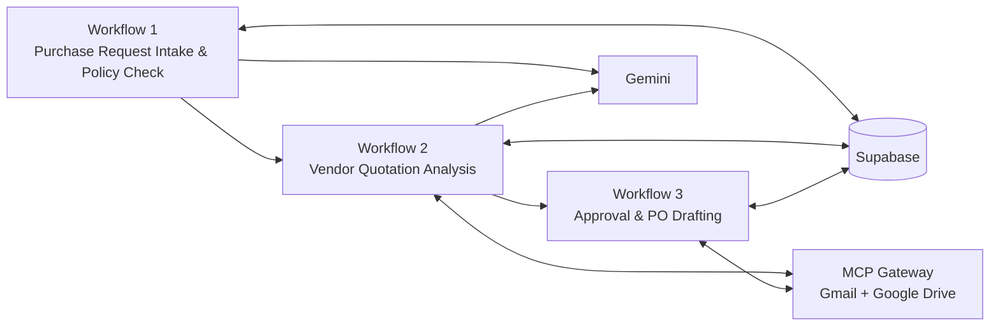

# Procurea — AI-Powered Procurement Automation

Procurea is a multi-workflow procurement automation project built in **n8n**. It combines deterministic procurement rules, AI-assisted analysis, Supabase persistence, human-in-the-loop approval, Gmail/Google Drive integrations, and an MCP gateway for reusable external tools.

## Architecture



## Workflows

### 1. Purchase Request Intake & Policy Check
- Accepts purchase requests through a webhook or manual test trigger.
- Validates required fields.
- Loads active procurement policies.
- Uses Gemini to structure and assess the business request.
- Applies approval thresholds deterministically in n8n.
- Persists the request and audit information.
- Hands the saved request ID to Workflow 2.

### 2. Vendor Quotation Analysis
- Receives `purchase_request_id` from Workflow 1.
- Retrieves the request and eligible vendors from Supabase.
- Uses the MCP gateway to search Gmail for vendor quotation emails.
- Extracts PDF/email quotation content.
- Uses Gemini structured output to extract commercial terms.
- Saves quotations to Supabase.
- Calculates deterministic vendor scores.
- Uses Gemini for recommendation reasoning, then verifies/overrides the result with deterministic n8n guardrails.
- Writes an audit record and asynchronously hands the request to Workflow 3.

### 3. Approval & PO Drafting
- Builds an approval packet using the selected vendor and quotation.
- Creates a pending approval record.
- Sends the approval request through the MCP Gmail tool.
- Pauses for human approval/rejection using an n8n form-based Wait node.
- On approval: marks the quotation selected, updates the request, generates a deterministic PO draft, creates a Google Doc through MCP, audits the result, and emails the requester a working PO link.
- On rejection: updates approval/request status, audits the decision, and sends a rejection notification.

## MCP Layer

`mcp/procurea-workspace-mcp-gateway.json` exposes reusable procurement tools for Gmail and Google Drive, including vendor-email search, quotation reading, procurement email sending, and PO draft upload.

`mcp/procurea-upload-drive-file.json` is the helper sub-workflow used to create a native Google Doc from deterministic PO text.

## Technology Stack

- **n8n** — workflow orchestration
- **Supabase / PostgreSQL** — purchase requests, vendors, quotations, approvals, audit logs
- **Google Gemini** — structured request/quotation analysis and recommendation reasoning
- **Gmail** — quotation intake and notifications
- **Google Drive / Docs** — quotation archiving and PO drafts
- **MCP (Model Context Protocol)** — reusable Gmail/Drive tool gateway
- **Human-in-the-loop** — approval/rejection through n8n Wait forms

## Repository Structure

```text
.
├── workflows/
│   ├── 01-purchase-request-intake-policy-check.json
│   ├── 02-vendor-quotation-analysis.json
│   └── 03-approval-po-drafting.json
├── mcp/
│   ├── procurea-workspace-mcp-gateway.json
│   └── procurea-upload-drive-file.json
├── .env.example
└── README.md
```

## Configuration

The exported files in this repository are **sanitized**. Credential bindings and hard-coded secrets have been removed.

For self-hosted n8n, configure:

```env
PROCUREA_SUPABASE_URL=https://YOUR_PROJECT.supabase.co
PROCUREA_SUPABASE_SECRET_KEY=your_supabase_secret_or_service_role_key
GEMINI_API_KEY=your_gemini_api_key
N8N_BLOCK_ENV_ACCESS_IN_NODE=false
```

Then re-select the required n8n credentials for:
- Supabase
- Gmail OAuth
- Google Drive OAuth
- MCP Bearer Auth

Because n8n workflow IDs are instance-specific, re-select the referenced sub-workflows after import:
- Workflow 1 → Workflow 2
- Workflow 2 → Workflow 3
- MCP Gateway → Upload Drive File helper

## Security

No API keys, OAuth tokens, Bearer tokens, or credential objects are intentionally committed. Keep `.env` files and exported credentials out of source control.

## Deployment Note

The project was developed and tested on a self-hosted n8n environment. Recent n8n releases can block `$env` access inside workflow nodes by default; if using the environment-variable configuration above, set `N8N_BLOCK_ENV_ACCESS_IN_NODE=false` or migrate those values to credential-backed nodes.

## Project Scope

Procurea demonstrates an end-to-end procurement automation design with:
- structured intake,
- deterministic policy enforcement,
- AI-assisted quotation extraction,
- vendor scoring and recommendation guardrails,
- MCP-based tool reuse,
- human approval,
- automated PO drafting,
- persistent auditability.

The repository contains the n8n workflow definitions needed to review or reproduce the implementation.
